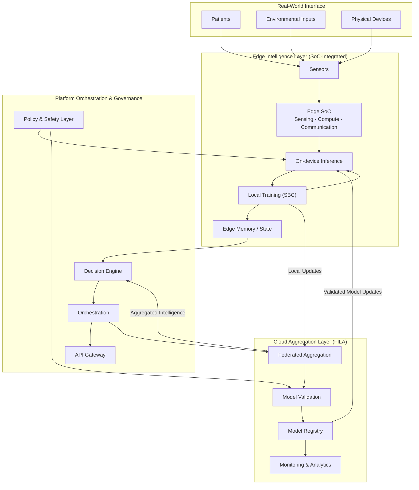

  

<h1 align="center">PeachBot Research & Innovations</h1>

  Biologically-Aware Edge Intelligence Systems

  
  
  

---

## Overview

PeachBot Research & Innovations is a deep-technology platform focused on the development and deployment of biologically-aware edge AI systems.

The platform has progressed through advanced prototyping and is now transitioning toward deployment-ready systems across healthcare, environmental intelligence, and distributed sensing environments.

---
## Compliance & Standards

  
  
  
  
  
  

PeachBot aligns with international data protection, healthcare interoperability, and emerging digital health governance frameworks across Singapore and India.

## Platform Status

**Validated MVP → Deployment Transition**

- Integrated multi-layer system architecture  
- Functional edge AI prototypes  
- Deployment-ready system modules  
- Ongoing optimization for real-world scalability  

---
## Product Verticals

### PeachBot MedAI+ (Clinical Intelligence)

- Edge-native diagnostics and biological signal intelligence  
- GNN-driven multi-modal medical inference  
- **Status:** Patent Published *(App No: 202541127477)*  

[Health Intelligence](https://peachbot.in/telemedicine-software)

---

### PeachBot Eco (Environmental Intelligence)

- Real-time monitoring of water systems and ecosystems  
- Distributed sensing with adaptive intelligence  
- **Status:** Live Deployment *(Ramsar Site: Sasthamkotta)*  

[Environmental & Ecological Intelligence](https://peachbot.in/ai-in-ecology)

---

### PeachBot AgriAI (Agricultural Intelligence)

- Precision agriculture using edge AI systems  
- Predictive and adaptive farm intelligence  

[Agricultural Intelligence Systems](https://peachbot.in/ai-in-agriculture)

---

### Biological Intelligence Research

- Adaptive learning architectures inspired by biological systems  
- Foundation layer for SBC and Edge-GNN models  

[Biological Intelligence Modeling](https://peachbot.in/ai-in-biology)

## Core Divisions

The PeachBot platform is structured as a **multi-layer, biologically-aware intelligence stack**, combining domain-specific applications with proprietary system frameworks spanning hardware, computation, and distributed learning.

---

### Applied Intelligence Domains
- Edge-native diagnostic and monitoring systems enabling real-time medical intelligence in constrained and latency-sensitive environments.
- Distributed sensing and adaptive response systems for environmental monitoring, ecological analysis, and real-time intelligence.
- Precision agriculture platforms leveraging edge AI for monitoring, prediction, and adaptive farm management.
- Development of biologically-inspired learning architectures enabling adaptive, resilient, and distributed intelligence systems.

---

### Core System Frameworks

**FILA (Federated Intelligence & Learning Architecture)**  
A distributed learning architecture where training occurs locally at the edge, with system-wide intelligence emerging through federated aggregation, validation, and controlled synchronization. Designed to minimize data centralization while preserving global coherence.

**SBC (Synthetic Biological Computation)**  
A proprietary computation paradigm inspired by biological systems, enabling state-aware, adaptive, and continuously evolving intelligence across dynamic and uncertain environments. SBC underpins local learning behavior and system adaptability.

**Edge SoC (System-on-Chip Intelligence Integration)**  
Hardware-integrated intelligence layer combining sensing, embedded AI acceleration, and communication within optimized SoC configurations. Enables efficient on-device inference and **localized training**, supporting real-time operation under strict resource constraints.

**Platform Orchestration & Governance Layer**  
A coordination layer responsible for decision orchestration, system-wide policy enforcement, safety constraints, and lifecycle management of distributed intelligence across edge nodes.

---

### System Perspective

Together, these components enable PeachBot to operate as a **distributed, edge-first intelligence system**, where:

- Learning is **localized and continuous**  
- Intelligence is **emergent and system-wide**  
- The cloud provides **aggregation, validation, and governance** — not centralized control  

**This architecture reflects a shift from conventional centralized AI systems toward **biologically-aligned, distributed intelligence infrastructures**.
---

## System Architecture

PeachBot is architected as a distributed, edge-first intelligence system, where learning and decision-making occur at the point of data generation.

The platform integrates interface, edge, coordination, and aggregation layers to enable adaptive, real-time intelligence in constrained environments, while maintaining system-wide consistency through controlled aggregation and model governance.

- **Interface Layer** — real-world interaction across patients, environmental inputs, and physical systems  
- **Edge Intelligence Layer** — sensing, on-device inference, and **local adaptive learning** under real-world constraints  
- **Platform Coordination Layer** — decision orchestration, policy control, and system-level intelligence management  
- **Cloud Aggregation Layer** — federated aggregation, model validation, and controlled model distribution  

The architecture prioritizes **edge-native intelligence**, where learning and adaptation occur locally, while the cloud provides **coordination, validation, and system-wide consistency** rather than centralized control.

---

## Platform Capabilities

- Edge-native AI execution  
- Real-time adaptive decision systems  
- Distributed intelligence coordination  
- Hybrid edge-cloud deployment models  

---

## Repository Structure

| Repository | Description |
|-----------|-------------|
| `peachbot-core` | Private core engine: SBC-based reasoning, signal processing, and decision orchestration |
| `peachbot-medical-kg` | Medical Knowledge Graph: evidence-backed clinical patterns and rule compilation |
| `peachbot-eco-kg` | Ecological Knowledge Graph: environmental signals, ecosystem patterns, and sustainability intelligence |
| `peachbot-agri-kg` | Agricultural Knowledge Graph: crop health, soil conditions, and agronomic patterns |
| `peachbot-bio-kg` | Biological Knowledge Graph: molecular, cellular, and bioinformatics pattern encoding |
| `peachbot-edge` | Edge execution layer: SBC deployment, on-device inference, and hardware integration |
| `peachbot-models` | AI and biologically-inspired models (supporting, non-core) |
| `peachbot-deploy` | Deployment pipelines, infrastructure, and environment configuration |
---

## Intellectual Property & Validation

**Patent Filing**  
Edge-Based Clinical Intelligence via Graph Neural Networks  
Application No: 202541127477  

**Deployment Validation**  
Field-tested environmental intelligence system deployment at  
Sasthamkotta Ramsar Site, India  

**Research Foundations**  
The PeachBot platform is supported by ongoing research in edge AI, biological intelligence, and distributed learning systems.

---

## Publications & Preprints

**Dedicated Edge-AI Single-Board Computer Systems for Ecological Monitoring in Protected Wetlands: Evidence from a Ramsar Site in India**  
*January 2026 · Environmental AI & Edge Computing · Preprint*  
Author: Swapin Vidya   
- DOI: *[rs.3.rs-8553049/v1](https://doi.org/10.21203/rs.3.rs-8553049/v1)*  
- License: CC BY 4.0  

---

**Edge-Based Execution of Graph Neural Networks for Protein Interaction Network Analysis in Clinical Oncology**  
*January 2026 · Edge AI & Computational Biology · Preprint*  
Author: Swapin Vidya  
- DOI: *[(rs.3.rs-8645211/v1)](https://doi.org/10.21203/rs.3.rs-8645211/v1)*  
- License: CC BY 4.0  

---

**Edge-GNN: A Constraint-Aware Graph Neural Network Framework for Resource-Efficient Biological Interaction Modeling**  
*March 2026 · Edge AI & Computational Biology · Preprint*  
Author: Swapin Vidya  
- DOI: *[(rs.3.rs-9096630/v1)](https://doi.org/10.21203/rs.3.rs-9096630/v1)*  
- License: CC BY 4.0  

---

## Compliance & Standards (Roadmap)

PeachBot is aligning with international standards for healthcare, data protection, and system reliability:

- HIPAA (Healthcare Data Compliance) — roadmap  
- GDPR (Data Protection & Privacy) — readiness alignment  
- ISO 13485 (Medical Device Systems) — planned  
- HL7 / FHIR interoperability — under integration  

---

## Engineering Approach

- Edge-first, distributed intelligence architecture  
- Local learning with federated coordination (FILA)  
- Hardware–software co-design with SoC-based systems  
- Deployment-oriented system engineering  

---

## Strategic Direction

PeachBot is transitioning from **validated research and MVP systems** toward **deployment-scale infrastructure**, with focus on:

- Clinical intelligence systems  
- Environmental monitoring networks  
- Distributed edge AI ecosystems  

---

## Collaboration & Partnerships

We are open to structured collaborations in research and deployment contexts, including:

- Clinical validation studies  
- Environmental monitoring initiatives  
- Academic and institutional partnerships

For collaboration inquiries:  
info@peachbot.in

## Contact

**PeachBot Research & Innovations**  
Singapore · India  

info@peachbot.in
