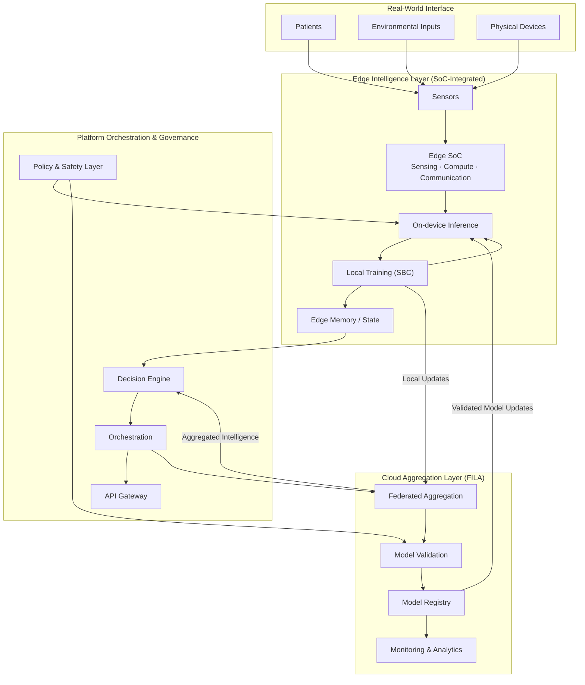

  

<h1 align="center">PeachBot Research & Innovations</h1>

  Biologically-Aware Edge Intelligence Systems

  
  
  

---

## Overview

PeachBot Research & Innovations is a deep-technology platform focused on the development and deployment of biologically-aware edge AI systems.

The platform has progressed through advanced prototyping and is now transitioning toward deployment-ready systems across healthcare, environmental intelligence, and distributed sensing environments.

---

## Platform Status

**Validated MVP → Deployment Transition**

- Integrated multi-layer system architecture  
- Functional edge AI prototypes  
- Deployment-ready system modules  
- Ongoing optimization for real-world scalability  

---

## Core Divisions

The PeachBot platform is structured as a **multi-layer, biologically-aware intelligence stack**, combining domain-specific applications with proprietary system frameworks spanning hardware, computation, and distributed learning.

---

### Applied Intelligence Domains

**[Health Intelligence (Telemedicine)](https://peachbot.in/telemedicine-software)**  
Edge-native diagnostic and monitoring systems enabling real-time medical intelligence in constrained and latency-sensitive environments.

**[Environmental & Ecological Intelligence](https://peachbot.in/ai-in-ecology)**  
Distributed sensing and adaptive response systems for environmental monitoring, ecological analysis, and real-time intelligence.

**[Agricultural Intelligence Systems](https://peachbot.in/ai-in-agriculture)**  
Precision agriculture platforms leveraging edge AI for monitoring, prediction, and adaptive farm management.

**[Biological Intelligence Modeling](https://peachbot.in/ai-in-biology)**  
Development of biologically-inspired learning architectures enabling adaptive, resilient, and distributed intelligence systems.

---

### Core System Frameworks

**FILA (Federated Intelligence & Learning Architecture)**  
A distributed learning architecture where training occurs locally at the edge, with system-wide intelligence emerging through federated aggregation, validation, and controlled synchronization. Designed to minimize data centralization while preserving global coherence.

**SBC (Synthetic Biological Computation)**  
A proprietary computation paradigm inspired by biological systems, enabling state-aware, adaptive, and continuously evolving intelligence across dynamic and uncertain environments. SBC underpins local learning behavior and system adaptability.

**Edge SoC (System-on-Chip Intelligence Integration)**  
Hardware-integrated intelligence layer combining sensing, embedded AI acceleration, and communication within optimized SoC configurations. Enables efficient on-device inference and **localized training**, supporting real-time operation under strict resource constraints.

**Platform Orchestration & Governance Layer**  
A coordination layer responsible for decision orchestration, system-wide policy enforcement, safety constraints, and lifecycle management of distributed intelligence across edge nodes.

---

### System Perspective

Together, these components enable PeachBot to operate as a **distributed, edge-first intelligence system**, where:

- Learning is **localized and continuous**  
- Intelligence is **emergent and system-wide**  
- The cloud provides **aggregation, validation, and governance** — not centralized control  

**This architecture reflects a shift from conventional centralized AI systems toward **biologically-aligned, distributed intelligence infrastructures**.
---

## System Architecture

PeachBot is architected as a distributed, edge-first intelligence system, where learning and decision-making occur at the point of data generation.

The platform integrates interface, edge, coordination, and aggregation layers to enable adaptive, real-time intelligence in constrained environments, while maintaining system-wide consistency through controlled aggregation and model governance.

- **Interface Layer** — real-world interaction across patients, environmental inputs, and physical systems  
- **Edge Intelligence Layer** — sensing, on-device inference, and **local adaptive learning** under real-world constraints  
- **Platform Coordination Layer** — decision orchestration, policy control, and system-level intelligence management  
- **Cloud Aggregation Layer** — federated aggregation, model validation, and controlled model distribution  

The architecture prioritizes **edge-native intelligence**, where learning and adaptation occur locally, while the cloud provides **coordination, validation, and system-wide consistency** rather than centralized control.

---

## Platform Capabilities

- Edge-native AI execution  
- Real-time adaptive decision systems  
- Distributed intelligence coordination  
- Hybrid edge-cloud deployment models  

---

## Platform Concepts

  
  
  

  MediAI · Environmental Intelligence · AgriAI Systems

## Application Domains

- Telemedicine edge diagnostics  
- Environmental monitoring systems  
- Adaptive intelligence platforms  

---

## Repository Structure

| Repository | Description |
|----------|------------|
| `peachbot-core` | Core system architecture and platform modules |
| `peachbot-edge` | Edge device and embedded AI systems |
| `peachbot-models` | AI models and biological intelligence frameworks |
| `peachbot-deploy` | Deployment infrastructure and configurations |

---

## Engineering Approach

- Systems-first architecture  
- Deployment-oriented engineering  
- Modular and scalable design  
- Efficiency at the edge  

---

## Intellectual Property

Core components are subject to:

- Proprietary system design  
- Active research and innovation  
- Potential patent filings  

---

## Collaboration

We collaborate with:

- Research institutions  
- Deep-tech partners  
- Deployment-focused organizations  

---

## Contact

**PeachBot Research & Innovations**  
Singapore · India  

info@peachbot.in
